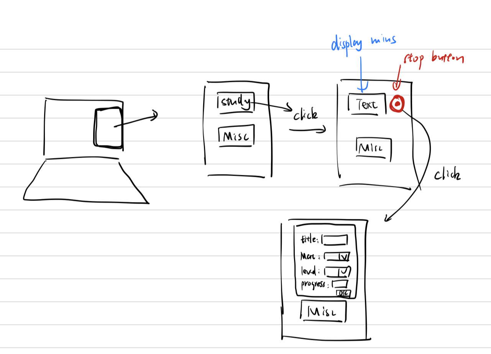

# Chronos

A timer trace the time I used

## Features

- [ ] Cross platform (apple device only)
- [ ] Cloud based
- [ ] Record time usage
- [ ] Varying difficulty levels
- [ ] Neat UI
- [ ] Detailed Info

## Front end design

- [ ] Floating slide panel, better to use hot key otherwise have to detect mouse event a lot
- [ ] Hot key toggle
- [ ] UI design like

And we store the data as follow into a excel file and used for the subsequent analysis

`Register Data`:

| *Register Date | Event Type | Title | Material Type |

*Event type*: study, review, misc

`Record Data`:

| *Date | Level | *Time Usage | Progress | Completed |

or I can register an event, so I don't need to type a lot of the same thing everytime.

every time I click, for example, study, it will pop out a window and ask to start a registered event or register a new one

## Misc thoughts

calculate avg difficulty level

what about online resources? they don't have a certain criteria

I can also record the work out time and period, like morning, afternoon or evening, to find out which period works best for me!

